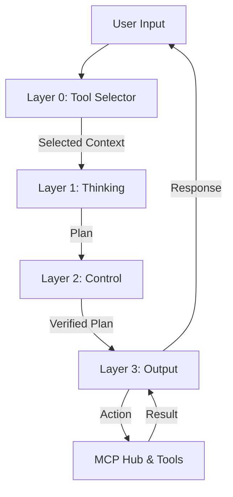

# TRION: Adaptive AI System

<div align="center">


**"TRION is more... alive in every thought."**


</div>

---

## 📖 Table of Contents

1. [**Philosophy & Vision**](#chapter-1-philosophy--vision)
2. [**Core Architecture (The Brain)**](#chapter-2-core-architecture-the-brain)
3. [**The Nervous System (MCP Hub)**](#chapter-3-the-nervous-system-mcp-hub)
4. [**Self-Awareness & Infrastructure**](#chapter-4-self-awareness--infrastructure)
5. [**Frontend Experience**](#chapter-5-frontend-experience)
6. [**Installation & Setup**](#chapter-6-installation--setup)
7. [**Documentation Map**](#chapter-7-documentation-map)

---

## Chapter 1: Philosophy & Vision

**TRION** is not just another LLM wrapper. It is a fully autonomous **Cognitive Operating System** designed to run on local hardware.

Most AI agents today are "System 1" thinkers—reactive, fast, and often prone to hallucination. TRION is built for **System 2 Thinking**: it separates reasoning from execution, allowing for safer, deeper, and more complex task completion.

* **Autonomy:** It creates its own tools and manages its own infrastructure.
* **Persistence:** It has a "Home" where it keeps notes and projects.
* **Safety:** Every action is verified by a separate control layer.

---

## Chapter 2: Core Architecture (The Brain)

TRION processes every request through a 4-Layer Cognitive Pipeline:



### Layer 0: Tool Selector (Attention Management)

* **Model:** Qwen 2.5 (1.5B)
* **Function:** Solves the "Attention Dilution" problem. Before reasoning begins, it uses semantic search to filter the 65+ available tools down to the 3-5 most relevant ones.

### Layer 1: Thinking (The Strategist)

* **Model:** DeepSeek-R1
* **Function:** Pure reasoning. It analyzes the user's intent, determines if memory access is needed, and creates a structured JSON plan. It does *not* have tool execution privileges.
* **Model:** DeepSeek-R1
* **Function:** Pure reasoning. It analyzes the user's intent, determines if memory access is needed, and creates a structured JSON plan. It does *not* have tool execution privileges.

### Layer 2: Control (The Critic)

* **Model:** Qwen 2.5
* **Function:** Verification. It checks the plan for safety risks (LightCIM), policy violations, and logic errors. For complex tasks, it engages **Sequential Thinking**—a live, step-by-step reasoning stream visible to the user.

### Layer 4: Tool Execution (The Body)

* **Model:** None (Deterministic)
* **Function:** Side-effect handling. The `ToolExecutor` service manages all physical actions: writing files, installing skills, and managing containers. This isolation ensures that the core reasoning engine never directly touches the filesystem.

### Layer 3: Output (The Agent)

* **Model:** Llama 3
* **Function:** Execution. It takes the verified plan, executes the necessary MCP tools (using Native Tool Calling), and generates the final response with the appropriate persona and tone.

---

## Chapter 3: The Nervous System (MCP Hub)

The **Model Context Protocol (MCP)** is the universal language of TRION. The system is built around a central **MCP Hub** that connects to over 65 tools.

* **Dynamic Loading:** New tools are discovered and registered at runtime.
* **Standardization:** Every tool follows a strict JSON schema compatible with OpenAI/Ollama specs.
* **Isolation:** Tools run in separate processes or containers, preventing a tool crash from taking down the core system.

### Key MCP Modules

* [**Admin API:**](Dokumentation/Admin%20API%20Adapter.md) Internal management interface.
* [**Skill Servers:**](Dokumentation/skill-servers.md) Microservices that host specialised skills.
* [**SQL Memory:**](Dokumentation/sql-memory:memory_mcp.md) Database interface for the AI.

---

## Chapter 4: Specialized Intelligence Modules

Beyond the core layers, TRION uses specialized modules for specific cognitive tasks:

### 🧠 Meta-Decision Module

* [**Docs:**](Dokumentation/meta_decision.md)
* **Purpose:** High-level strategy. It decides *how* to solve a problem (e.g., "Do I need to write code for this, or can I use an existing tool?").

### 🛡️ Validator & Classifier

* [**Docs:**](Dokumentation/validator.md) | [**Docs:**](Dokumentation/classifier.md)
* **Validator:** Post-execution check. Did the tool output match the expectation?
* **Classifier:** Rapidly categorizes user input to route it to the correct subsystem (e.g., "This is a Code request" vs "This is a Chat request").

### 🔒 CIM Policy (Cognitive Immune System)

* [**Docs:**](Dokumentation/intelligence_modules:cim_policy.md)
* **Purpose:** Advanced safety. Unlike simple filters, CIM understands *context*. It prevents the AI from being socially engineered into performing harmful actions.

---

## Chapter 5: Self-Awareness & Infrastructure

### 🏠 TRION Home (New in v4.0)

TRION is aware of its own persistent environment. It has a mounted home directory (`/home/trion`) where it can:

* **Write/Read Notes:** "Remember this" automatically saves to `notes/`.
* **Manage Projects:** Store code and documents persistently across restarts.
* **Self-Configure:** Edit its own config files.

### 🐳 Container Commander

TRION acts as its own DevOps engineer. It can spawn Docker containers on-the-fly to execute code safely.

* [**Deep Dive:**](Dokumentation/container-session-reuse.md)
* **Blueprints:** Pre-configured environments (`python-sandbox`, `web-scraper`, `postgres-db`).
* **Lifecycle Management:** Automatically monitors CPU/RAM usage and stops idle containers to save resources.
* **Sandboxing:** No code is ever executed on the host machine.

---

## Chapter 6: Frontend Experience

The interface interacts like a modern Operating System for AI.

* **Terminal App:** A full `xterm.js` console to interact with the Container Commander.
* **Skills Studio:** An IDE (Monaco Editor) for writing and testing new AI skills.
* **Protocol:** A chronological timeline of the AI's "thoughts" (Layers 1/2) and actions (Layer 3).
* **Settings:** Ubuntu-style configuration panel for Persona, Models, and Memory.
* [**Full Frontend Docs**](Dokumentation/apps.md)

---

## Chapter 7: Installation & Setup

### Prerequisites

* **Docker** & Docker Compose (running)
* **Python 3.12+**
* **UV** (fast Python package manager)
* **Ollama** (for local LLM inference)

### 1. Clone & Setup

```bash
git clone https://github.com/danny094/Jarvis.git
cd Jarvis

# Create virtual environment
uv venv
source .venv/bin/activate

# Install dependencies
uv pip install -r requirements.txt
```

### 2. Configuration

Copy the example config and adjust your paths/models:

```bash
cp config/example_config.yaml config/config.yaml
```

### 3. Start System

```bash
# Start backend services (Postgres, Qdrant, Redis)
docker-compose up -d

# Start TRION Core
python main.py
```

---

## Chapter 8: Documentation Map

Detailed technical documentation is available in the `Dokumentation/` directory:

| Domain | Document | Description |
|--------|----------|-------------|
| **Core** | [core.md](Dokumentation/core.md) | Deep dive into the Cognitive Architecture. |
| **Logic** | [meta_decision.md](Dokumentation/meta_decision.md) | Decision making strategies. |
| **Logic** | [sequential-thinking.md](Dokumentation/sequential-thinking.md) | Complex reasoning chains. |
| **Data** | [sql-memory.md](Dokumentation/sql-memory.md) | Graph & Vector database specs. |
| **Tools** | [mcp.md](Dokumentation/mcp.md) | The Tool Hub. |
| **Tools** | [tool_executor.md](Dokumentation/tool_executor.md) | Side-effect handler. |
| **Infra** | [container-session-reuse.md](Dokumentation/container-session-reuse.md) | Docker orchestration. |
| **UI** | [apps.md](Dokumentation/apps.md) | JS Apps architecture. |

---


