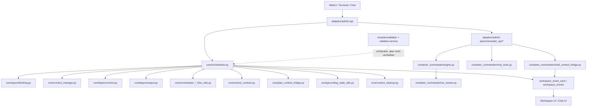
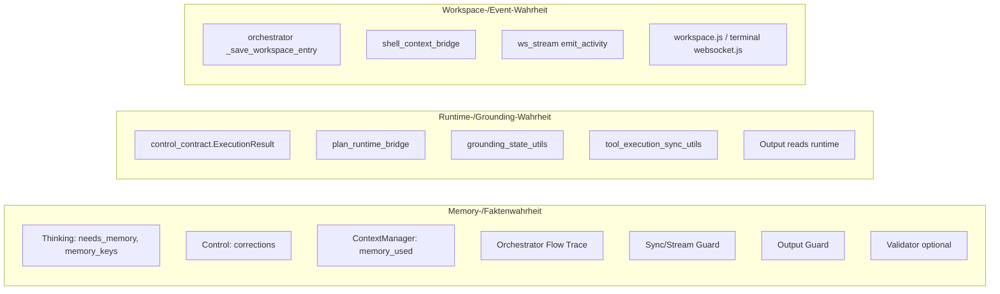

# TRION Code-Atlas und Konsolidierungsanalyse

Erstellt am: 2026-03-29
Status: **Architektur-Analyse**
Bezieht sich auf:

- [[2026-03-29-halluzinations-guard-analyse]]
- [[2026-03-29-halluzinations-guard-implementationsplan]]

---

## Zweck

Diese Notiz ist **kein Fix-Plan fuer ein einzelnes Bugthema**, sondern eine visuelle Architekturkarte fuer den aktuellen TRION-Code.

Sie soll drei Dinge beantworten:

1. **Welche Module machen was?**
2. **Wo sind dieselben Kernwahrheiten ueber mehrere Dateien verteilt?**
3. **Welche Teile sind doppelt, parallel oder unnoetig auseinandergezogen?**

Ziel:

- den Code wieder als **System** sichtbar machen
- Konsolidierungspotenziale klar benennen
- unterscheiden zwischen:
  - sinnvoll getrennt
  - historisch gewachsen
  - unnötig dupliziert

---

## TL;DR

TRION ist nicht ungeordnet, aber **architektonisch breit**.

Das Hauptproblem ist nicht "zu viele Dateien", sondern:

- dieselbe Wahrheit lebt oft in mehreren Stellvertretern
- Sync-, Stream- und Sonderpfade rechnen aehnliche Dinge separat
- es gibt vorbereitete, aber nicht voll durchgezogene Integrationspfade

Die groessten Konsolidierungsthemen sind:

1. **Memory-/Faktenwahrheit**
2. **Runtime-/Grounding-Wahrheit**
3. **Workspace-/Event-Wahrheit**
4. **Sync-/Stream-Paritaet**
5. **Container-/Session-State-Wahrheit**

Wichtig:

- Nicht alles zusammenlegen.
- Erst die **zentralen Wahrheiten** konsolidieren.
- Danach wird der Code fast automatisch kleiner.

---

## Visuelle Gesamtkarte

---

## Die groessten Dateien

Diese Liste ist kein Vorwurf. Sie zeigt nur, wo heute die meiste Systemlast sitzt.

| Datei | Zeilen | Rolle |
|---|---:|---|
| `core/orchestrator.py` | 5008 | Haupt-Fassade, Composition Root, Runtime-Hub |
| `adapters/admin-api/main.py` | 2343 | API-Bootstrap + Jobs + Chat + Workspace + Runtime-Endpunkte |
| `core/orchestrator_stream_flow_utils.py` | 2139 | Streaming-Pipeline |
| `core/layers/control.py` | 2107 | Control-Layer, Policy-/Prompt-/Verification-Logik |
| `core/layers/output.py` | 1855 | Output-Layer, Tool-Loop, Promptbau, Grounding-Verhalten |
| `core/context_cleanup.py` | 1648 | Workspace-Event -> Compact Context |
| `adapters/admin-api/commander_api/containers.py` | 1616 | TRION Shell / Container Debug / Shell Control-Pfad |
| `container_commander/mcp_tools.py` | 1581 | MCP-Registry und Container-Tool-Dispatch |
| `container_commander/engine.py` | 1528 | Commander Lifecycle-/Docker-Orchestrierung |
| `core/context_manager.py` | 1490 | Memory-/System-/Context-Retrieval |

Lesart:

- `core/orchestrator.py` ist heute zugleich:
  - Composition Root
  - Integrations-Hub
  - Zustands-Hub
  - Flow-Fassade
  - Event-Emitter

- `adapters/admin-api/main.py` ist heute zugleich:
  - App-Bootstrap
  - Router-Montage
  - Jobsystem
  - Workspace-Endpunkte
  - Chat- und Runtime-Nebenlogik

---

## Modulkarte nach Verantwortungsbereichen

### 1. Orchestrierung

**Hauptmodule**

- `core/orchestrator.py`
- `core/orchestrator_sync_flow_utils.py`
- `core/orchestrator_stream_flow_utils.py`
- `core/orchestrator_flow_utils.py`

**Verantwortung**

- Einstieg in den Chat-Lauf
- Routing zwischen Sync / Stream / LoopEngine / Sonderpfaden
- Control-/Output-/Context-Zusammenbau
- Zustands- und Event-Glue

**Befund**

- Gute Absicht: Flow-Utils ausgelagert
- Problem: dieselbe Semantik lebt weiterhin verteilt ueber Hauptdatei + Utils

### 2. Denk-/Kontroll-/Antwort-Layer

**Hauptmodule**

- `core/layers/thinking.py`
- `core/layers/control.py`
- `core/layers/output.py`

**Verantwortung**

- Thinking: Plan und semantische Absicht
- Control: Korrektur, Policy, Freigabe, Hard-Block
- Output: Antwort-Generierung, Tool Calling, Grounding-Fallbacks

**Befund**

- Das Drei-Layer-Modell ist sinnvoll
- Aber mehrere Wahrheiten laufen quer dazu:
  - Memory-Wahrheit
  - Grounding-Wahrheit
  - Runtime-Ergebnis

### 3. Kontext und Memory

**Hauptmodule**

- `core/context_manager.py`
- `core/context_cleanup.py`
- `core/persona.py`
- `core/context_compressor.py`

**Verantwortung**

- ContextManager: Retrieval
- ContextCleanup: semantische Verdichtung fuer kleine Modelle
- Persona: User-/System-Prompt-Identitaet
- Compressor: Rolling Summary / Protokoll-Last reduzieren

**Befund**

- Fachlich sinnvoll getrennt
- Aber die Retrieval-Wahrheit ist heute zu grob modelliert

### 4. Verträge und Runtime-Zustand

**Hauptmodule**

- `core/control_contract.py`
- `core/plan_runtime_bridge.py`
- `core/grounding_state_utils.py`
- `core/orchestrator_tool_execution_sync_utils.py`

**Verantwortung**

- ControlDecision / ExecutionResult als Verträge
- Legacy-Felder -> neue Runtime-Struktur ueberfuehren
- Grounding-Evidenz aufbereiten
- Tool-Ausfuehrung mit Runtime-Metadaten koppeln

**Befund**

- Gute Richtung: typed contracts existieren
- Problem: Legacy-Kompatibilitaet und neue Struktur laufen parallel

### 5. Workspace, Telemetrie und UI-Sichtbarkeit

**Hauptmodule**

- `core/workspace_event_utils.py`
- `core/orchestrator.py` (`_save_workspace_entry`)
- `container_commander/shell_context_bridge.py`
- `container_commander/ws_stream.py`
- `adapters/Jarvis/static/js/workspace.js`
- `adapters/Jarvis/js/apps/terminal/websocket.js`

**Verantwortung**

- interne Events speichern
- UI-kompatible `workspace_update`-Signale formen
- Chat- und Shell-Ereignisse sichtbar machen

**Befund**

- Event-Pipeline funktioniert
- aber es gibt mehrere Emissionspfade fuer dieselbe UI-Wahrheit

### 6. Container Commander

**Hauptmodule**

- `container_commander/engine.py`
- `container_commander/engine_*`
- `container_commander/mcp_tools.py`
- `container_commander/mcp_tools_*`
- `adapters/admin-api/commander_api/containers.py`

**Verantwortung**

- Container Lifecycle
- MCP-Tool-Expose
- Shell-Mode
- Commander-spezifischer Runtime-Zustand

**Befund**

- Hier ist schon sichtbar konsolidiert worden
- insbesondere `engine.py` -> `engine_*` und `mcp_tools.py` -> `mcp_tools_*`
- das ist eher ein positives Beispiel als ein Problemherd

---

## Wo dieselben Kernwahrheiten verstreut sind

## A. Memory-/Faktenwahrheit

### Die eigentliche Wahrheit

Eigentlich gibt es nur eine Kernfrage:

- **Welche Fakten wurden angefragt, gefunden oder nicht gefunden?**

### Heute verteilt ueber

- `core/layers/thinking.py`
  - `needs_memory`
  - `memory_keys`
  - `is_fact_query`
- `core/layers/control.py`
  - korrigiert dieselben Felder erneut
- `core/context_manager.py`
  - sucht Facts, kennt aber nur `memory_used`
- `core/orchestrator_flow_utils.py`
  - uebernimmt nur groben Trace
- `core/orchestrator_sync_flow_utils.py`
  - baut Guard daraus
- `core/orchestrator_stream_flow_utils.py`
  - baut andere Pfade daraus
- `core/layers/output.py`
  - reagiert auf `memory_required_but_missing`
- `modules/validator/validator_client.py`
  - optional spaete Zusatzpruefung

### Problem

Die Wahrheit ist nicht als ein eigenes Objekt vorhanden.

Stattdessen gibt es Stellvertreter:

- `needs_memory`
- `is_fact_query`
- `hallucination_risk`
- `memory_used`
- `memory_required_but_missing`

### Konsolidierungskandidat

Ein eigenes kleines Domänenobjekt, z. B.:

- `MemoryResolution`
  - `requested_keys`
  - `found_keys`
  - `missing_keys`
  - `required_memory_missing`

### Stand nach Fix — 2026-03-29

Die verteilte Memory-Wahrheit wurde **partiell konsolidiert** (Phase 1–5 des Plans).

Konkret umgesetzt:

- `ContextResult` traegt jetzt `memory_keys_requested`, `memory_keys_found`, `memory_keys_not_found`
- `build_effective_context()` propagiert alle drei Felder in den Trace
- Sync-Guard, Stream-Guard und LoopEngine nutzen jetzt dasselbe `memory_keys_not_found`-Signal
- `memory_used` ist nicht mehr Guard-Signal — nur noch Retrieval-Indikator

Noch offen aus dieser Wahrheit:

- `MemoryResolution` als echtes Domaenobjekt (statt drei Einzelfelder auf `ContextResult`)
- Validator-Integration (Phase 6, optional)

Details: [[2026-03-29-halluzinations-guard-implementationsplan]]

### Bewertung

**Hoher Nutzen, hohe Prioritaet — Teilumsetzung done**

---

## B. Runtime-/Grounding-Wahrheit

### Die eigentliche Wahrheit

Eigentlich gibt es nur diese Kernfrage:

- **Was wurde zur Laufzeit wirklich ausgefuehrt und welche Evidenz liegt dafuer vor?**

### Heute verteilt ueber

- `core/control_contract.py`
  - `ExecutionResult`
- `core/plan_runtime_bridge.py`
  - neue Runtime-Struktur plus Legacy-Dual-Write
- `core/grounding_state_utils.py`
  - carryover, usable evidence, selection
- `core/orchestrator_tool_execution_sync_utils.py`
  - Tool-Ausfuehrung plus Evidence-Anreicherung
- `core/layers/output.py`
  - liest `direct_response`, `tool_results`, `grounding_evidence`
- `core/orchestrator.py`
  - orchestriert zusätzliche Grounding-Checks

### Problem

Der Code ist bereits in der Migration:

- neue Contract-Wahrheit vorhanden
- alte `verified_plan["_legacy_key"]`-Wahrheit noch parallel da

Das ist sichtbar in:

- `core/plan_runtime_bridge.py`
  - Legacy keys
  - Adoption
  - Dual write / fallback

### Stand nach Fix — 2026-03-30

**Abgeschlossen.** `_execution_result` ist die einzige Runtime-Wahrheit.

- Legacy-Dual-Write entfernt
- Legacy-Read-Fallback entfernt
- `plan_runtime_bridge.py` halbiert (391 → 185 Zeilen)
- Alle Leser/Schreiber gehen ausschliesslich ueber Bridge-Funktionen

### Bewertung

**Abgeschlossen ✓**

---

## C. Workspace-/Event-Wahrheit

### Die eigentliche Wahrheit

Eigentlich gibt es nur:

- **Ein internes Ereignis soll persistiert und im UI sichtbar werden**

### Heute verteilt ueber

- `core/orchestrator.py`
  - `_save_workspace_entry()`
- `core/workspace_event_utils.py`
  - Event-Summary-Helfer
- `container_commander/shell_context_bridge.py`
  - eigener Save- plus Mirror-Pfad
- `container_commander/ws_stream.py`
  - `emit_activity(...)`
- `adapters/Jarvis/static/js/workspace.js`
  - liest `workspace_update`
- `adapters/Jarvis/js/apps/terminal/websocket.js`
  - spiegelt Commander-Events in `sse-event`

### Problem

Es gibt mindestens zwei Pfade fuer dieselbe UI-Wahrheit:

1. Chat-Orchestrator -> `workspace_event_save` -> direktes `workspace_update`
2. Shell/Commander -> `workspace_event_save` -> `emit_activity("workspace_update")` -> Frontend-Bruecke

### Konsolidierungskandidat

Ein zentrales Modul wie:

- `workspace_event_emitter.py`

das einheitlich kann:

1. persistieren
2. `workspace_update` bauen
3. passenden Live-Kanal bedienen

### Stand nach Fix — 2026-03-31

**Abgeschlossen.** `WorkspaceEventEmitter` ist die einzige Emissionsstelle.

- `hub.call_tool("workspace_event_save")` wird ausschliesslich durch `WorkspaceEventEmitter` aufgerufen
- `orchestrator._save_workspace_entry` + `_save_container_event` delegieren an den Emitter
- `shell_context_bridge` hat keinen direkten Fast-Lane-Call mehr — nutzt `persist_and_broadcast()`
- Sync-Pfad schreibt jetzt 3 Workspace-Entries (war vorher 0 — komplette Lücke)
- Drift-Guard in `tests/drift/test_workspace_event_paths.py` verhindert zukünftigen Drift
- Legacy-Aufrufer in `adapters/admin-api/` sind dokumentiert (noch nicht migriert, kein Core-Scope)

Details: [[2026-03-31-workspace-event-emitter-implementationsplan]] — Abschlussvermerk

### Bewertung

**Abgeschlossen ✓**

---

## D. Container-/Session-State-Wahrheit

### Die eigentliche Wahrheit

Eigentlich gibt es nur:

- **welcher Container ist zuletzt relevant**
- **welche Container gelten fuer diese Conversation als bekannt**

### Heute verteilt ueber

- `core/container_state_utils.py`
- `core/orchestrator.py`
  - `_conversation_container_state`
  - `_remember_container_state`
- `adapters/admin-api/commander_api/containers.py`
  - `_remember_container_state(...)` via Orchestrator
- `container_commander/engine.py`
  - `_active`
- `container_commander/engine_runtime_state.py`
  - Runtime-State / Recovery

### Problem

Es gibt mehrere State-Typen fuer aehnliche Container-Wahrheiten:

- Docker-Runtime-Wahrheit
- Commander-Runtime-Wahrheit
- Orchestrator-Conversation-Wahrheit
- Shell-Session-Wahrheit

Das ist nicht automatisch falsch, aber schwer zu ueberblicken.

### Konsolidierungskandidat

Nicht alles zusammenwerfen.

Sinnvoll waere:

- einen klar benannten `ConversationContainerState`
- getrennt von echtem Docker-/Commander-Runtime-State

### Bewertung

**Mittlerer Nutzen, mittlere Prioritaet**

---

## E. Chat-Konsistenzwahrheit

### Die eigentliche Wahrheit

- **Was hat TRION in derselben Conversation zu einem Thema bereits behauptet?**

### Heute verteilt ueber

- `core/conversation_consistency.py`
- `core/conversation_consistency_policy.py`
- `core/orchestrator.py`
  - Consistency guard und Conversation-State

### Problem

Das ist eine zusätzliche Wahrheitsschicht neben:

- Memory
- Grounding
- Runtime

Sie ist fachlich sinnvoll, aber vergroessert die Systembreite.

### Bewertung

**Sinnvoll getrennt**

Nicht jetzt zusammenlegen.

---

## Doppelte oder parallel laufende Aufrufmuster

## 1. Sync-/Stream-Pipeline-Preamble ist stark dupliziert

Die folgenden Schritte existieren in beiden Flows separat:

- Tool-Selection
- Tool-Filter
- Short-Input-Bypass
- Query-Budget-Signal
- Domain-Route-Signal
- Context-Build
- Output-Model-Resolution
- Conversation-Consistency-Guard
- Memory-Save

Das ist direkt sichtbar in:

- `core/orchestrator_sync_flow_utils.py`
- `core/orchestrator_stream_flow_utils.py`

### Lesart

Nicht 100% identischer Code, aber **semantisch derselbe Schrittbaukasten**.

### Konsolidierungskandidat

Gemeinsame Stages:

- `prepare_pipeline_inputs(...)`
- `resolve_context_stage(...)`
- `finalize_response_stage(...)`

### Bewertung

**Hoher Nutzen**

Das ist einer der besten Kandidaten fuer echte Verkleinerung.

---

## 2. Output-Entry ist unnötig gespalten

Heute:

- Sync geht ueber `orch._execute_output_layer(...)`
- Stream ruft `orch.output.generate_stream(...)` direkt
- LoopEngine baut teils den Prompt direkt

### Problem

Die Guard- und Output-Semantik muss dadurch ueber mehrere Entry-Points synchron bleiben.

### Konsolidierungskandidat

Ein gemeinsames Output-Stage-Modell:

- `prepare_output_invocation(...)`
- `run_output_nonstream(...)`
- `run_output_stream(...)`
- `run_output_loopengine(...)`

aber alle aus **einer** gemeinsamen Vorbereitungsfunktion gespeist

### Bewertung

**Sehr hoher Nutzen**

---

## 3. Workspace-Event-Emission ist doppelt gedacht

Heute gibt es:

- Save + SSE-Payload im Orchestrator
- Save + Commander-Mirror im Shell-Bridge-Pfad

### Problem

Funktioniert, aber dieselbe Absicht ist auf zwei Mechaniken verteilt.

### Konsolidierungskandidat

Zentraler Workspace-Emitter mit:

- Persistierung
- UI-Payload-Normalisierung
- Transportwahl

### Bewertung

**Mittlerer Nutzen**

---

## 4. Runtime-State — Migration abgeschlossen (2026-03-30)

- `_execution_result` ist die einzige Wahrheit
- Legacy-Keys und Dual-Write vollstaendig entfernt

### Bewertung

**Abgeschlossen ✓**

---

## Was sinnvoll getrennt ist und nicht voreilig zusammengelegt werden sollte

Nicht alles ist „zu verteilt“.

Diese Trennungen wirken sinnvoll:

### 1. `context_manager.py` vs `context_cleanup.py`

Warum sinnvoll:

- Retrieval ist etwas anderes als semantische Verdichtung

### 2. `Thinking` / `Control` / `Output`

Warum sinnvoll:

- gute konzeptionelle Kernarchitektur

### 3. `engine.py` + `engine_*`

Warum sinnvoll:

- hier wurde bereits erfolgreich entkoppelt

### 4. `mcp_tools.py` + `mcp_tools_*`

Warum sinnvoll:

- Registry/Dispatch von Fachimplementierung getrennt

### 5. `conversation_consistency.py`

Warum sinnvoll:

- eigene Wahrheitsschicht, nicht einfach mit Memory oder Grounding vermischen

---

## Wo ich zuerst konsolidieren wuerde

## Prioritaet 1 — Wahrheits-Contracts

### 1. Memory-/Fact-Resolution als explizites Objekt

Status: **abgeschlossen (2026-03-29)**

Umgesetzt in zwei Schritten:

1. Guard-Verdrahtung durch alle Pfade (Sync, Stream, LoopEngine) → [[2026-03-29-halluzinations-guard-implementationsplan]]
2. `MemoryResolution` Domaenobjekt — einzige Wahrheitsquelle, `required_missing` wird nicht mehr doppelt berechnet → [[2026-03-29-memory-resolution-contract-plan]]

Noch offen (optional): Phase 4 (Output bekommt volles Objekt statt Bool), Validator-Integration.

Eingetretene Wirkung:

- Halluzinationsschutz deterministisch in allen Pfaden (Sync, Stream, LoopEngine)
- `required_missing` wird einmal zentral berechnet — kein Drift mehr moeglich
- 5 Stellvertreter (`needs_memory`, `is_fact_query`, `memory_used`, `memory_keys_not_found`, `memory_required_but_missing`) auf 1 Objekt reduziert

### 2. Runtime-/Grounding-Result final auf Contract ziehen

Status: **abgeschlossen (2026-03-30)**

Umgesetzt:

- `plan_runtime_bridge.py` vollständig bereinigt (391 → 185 Zeilen): `LEGACY_POLICY_KEYS`, `LEGACY_RUNTIME_KEYS`, `_LEGACY_GROUNDING_KEY_MAP`, `legacy_runtime_compat_enabled()`, `_use_dual_write()`, `_allow_legacy_read_fallback()`, `adopt_legacy_runtime_fields()`, `_adopt_runtime_if_needed()` sowie alle `dual_write=`-Parameter und Fallback-Blöcke entfernt
- `output.py`: `legacy_key=`-Parameter aus `_set_runtime_grounding_value` und alle 34 Aufruf-Kwargs entfernt
- `orchestrator.py`: 3 `legacy_key=`-Kwargs aus `get_runtime_grounding_value`-Aufrufen entfernt
- `get_runtime_grounding_value`: `legacy_key`-Parameter entfernt — liest ausschliesslich aus `_execution_result.grounding`
- Alle betroffenen Tests auf Bridge-Funktionen umgestellt (`set_runtime_grounding_evidence`, `set_runtime_tool_results` etc.)
- `test_no_direct_legacy_runtime_writes.py` geloescht (referenziert `LEGACY_RUNTIME_KEYS` das nicht mehr existiert)

Eingetretene Wirkung:

- `_execution_result` ist jetzt die einzige Runtime-Wahrheit — kein Dual-Write, keine Fallback-Pfade
- `TRION_LEGACY_RUNTIME_COMPAT`-Flag hat keine Wirkung mehr und kann aus .env entfernt werden
- Kein Drift zwischen alten `_grounding_*`-Keys und Contract-Struktur mehr moeglich

## Prioritaet 2 — Pfad-Paritaet

### 3. Gemeinsame Vorbereitungs- und Abschlussstages fuer Sync/Stream

Erwartete Wirkung:

- weniger Drift
- kleinerer Flow-Code

### 4. Ein gemeinsamer Output-Entry

Erwartete Wirkung:

- weniger Guard-Bypasses
- weniger Sonderwissen in Stream/LoopEngine

## Prioritaet 3 — Infrastruktur-Glue

### 5. Workspace-Event-Emitter vereinheitlichen

### 6. `adapters/admin-api/main.py` als Bootstrap von Feature-Logik trennen

---

## Lesepfad fuer Menschen

Wenn du den Code manuell verstehen willst, ist diese Reihenfolge effizienter als „oben anfangen und leiden“:

### Stufe 1 — Systemidee

1. `core/layers/thinking.py`
2. `core/layers/control.py`
3. `core/layers/output.py`
4. `core/control_contract.py`

### Stufe 2 — Wie Kontext und Wahrheit gebaut werden

5. `core/context_manager.py`
6. `core/context_cleanup.py`
7. `core/plan_runtime_bridge.py`
8. `core/grounding_state_utils.py`

### Stufe 3 — Wie der Orchestrator die Teile verbindet

9. `core/orchestrator_flow_utils.py`
10. `core/orchestrator_sync_flow_utils.py`
11. `core/orchestrator_stream_flow_utils.py`
12. `core/orchestrator.py`

### Stufe 4 — Commander-Seite

13. `container_commander/engine.py`
14. `container_commander/mcp_tools.py`
15. `adapters/admin-api/commander_api/containers.py`
16. `container_commander/shell_context_bridge.py`

### Stufe 5 — UI-/Event-Seite

17. `core/workspace_event_utils.py`
18. `adapters/Jarvis/static/js/workspace.js`
19. `adapters/Jarvis/js/apps/terminal/websocket.js`

---

## Visuelle Karte der verstreuten Wahrheiten

---

## Fazit

Der Code ist nicht „einfach nur zu groß“.

Er ist vor allem:

- auf mehreren starken Achsen gewachsen
- mit guten Trennungsabsichten
- aber mit zu vielen verteilten Wahrheits-Stellvertretern

Die wichtigste Erkenntnis ist:

- **Die nächste Reduktion sollte nicht mit Dateien beginnen, sondern mit Wahrheiten.**

Wenn diese Wahrheiten zentralisiert sind, werden diese Dinge leichter:

- Sync/Stream-Paritaet
- Guard-Konsistenz
- kleinere Flow-Utils
- weniger Glue-Code
- leichteres mentales Modell

In einem Satz:

- **Nicht zuerst den Code "schöner" machen, sondern zuerst die Kernwahrheiten zentralisieren; danach wird die Verkleinerung deutlich einfacher und sicherer.**

---

## Umsetzungs-Fortschritt (Stand 2026-03-29)

| Atlas-Wahrheit | Status | Verweis |
|---|---|---|
| A. Memory-/Faktenwahrheit | **abgeschlossen** ✓ | [[2026-03-29-halluzinations-guard-implementationsplan]] · [[2026-03-29-memory-resolution-contract-plan]] |
| B. Runtime-/Grounding-Wahrheit | **abgeschlossen** ✓ | Legacy vollstaendig geloescht (2026-03-30) |
| C. Workspace-/Event-Wahrheit | **abgeschlossen** ✓ | [[2026-03-31-workspace-event-emitter-implementationsplan]] |
| D. Container-/Session-State-Wahrheit | **abgeschlossen** ✓ | [[2026-03-31-container-session-state-konsolidierung]] |
| E. Chat-Konsistenzwahrheit | Sinnvoll getrennt, kein Handlungsbedarf | — |
| Sync/Stream Pipeline-Preamble | **abgeschlossen** ✓ | [[2026-03-29-sync-stream-pipeline-preamble-konsolidierung]] |
| Output-Entry-Konsolidierung | **abgeschlossen** ✓ | [[2026-03-30-output-entry-konsolidierung-implementationsplan]] |

### Sync/Stream Pipeline-Preamble — Abschlussvermerk (2026-03-30)

Alle drei Stages extrahiert und in beiden Flows eingebunden:

- `run_pre_control_gates()` — Skill-Dedup, Container-Candidate-Evidence, Hardware-Gate-Early
- `run_plan_finalization()` — Schema-Coerce, Budget/Domain-Apply, Policy-Conflicts, Response-Mode
- `run_tool_selection_stage()` — last_assistant_msg, select_tools, Short-Input-Bypass, Budget/Domain-Classify

Fix9-/Fix10-Testsuite aktualisiert: Suche zielt jetzt korrekt auf `pipeline_stages.py` statt veralteten `STEP 1.8`-Block in `orchestrator_stream_flow_utils.py`.

Unit-Gate Stand 2026-03-30: **2489 passed, 3 skipped, 28 failed**

Die 28 Failures sind ausschliesslich neue Drift-/Contract-Tests im Branch `feat/drift-testsuite`, die noch nicht erfuellte Anforderungen pruefen (kein Regression):

| Gruppe | Anzahl | Art |
|---|---:|---|
| `test_frontend_terminal_runtime_ux_contract` | 8 | Frontend-UX-Contracts (Slash-Commands, Dashboard, Logs etc.) |
| `test_frontend_terminal_approval_center_contract` | 4 | Approval-Center-Markup und API-Wiring |
| `test_frontend_terminal_preflight_contract` | 3 | Preflight-Modal, Deploy-Overrides, Blueprint-Cards |
| `test_container_commander_hardware_resolution` | 3 | Hardware-Resolution device_overrides-Logik |
| `test_container_commander_managed_storage_picker_contract` | 2 | Storage-Picker Approval-Replay |
| `test_trion_memory_webui_wiring_contract` | 2 | Memory-Panel WebUI-Verdrahtung |
| Weitere (port_management, secrets, api_hardening, gateway, context_pipeline) | 6 | diverse Contract-Gaps |

**Naechster sinnvoller Schritt:**

Option A (Drift-Tests gruen machen): Die 28 Contract-Tests nach Gruppe abarbeiten — Frontend-UX-Contracts haben den groessten Block (8+4+3=15).

Option B (Architektur-Konsolidierung — Prioritaet 2): Output-Entry konsolidieren — Sync/Stream/LoopEngine aus einer gemeinsamen Vorbereitungsfunktion speisen.

→ Entschieden: **Option A** — Implementationsplan: [[2026-03-30-drift-testsuite-implementationsplan]]

**Unit-Gate Stand 2026-03-30 nach Legacy-Bereinigung: 2487 passed · 3 skipped · 28 failed** (unveraendert — keine Regression)

**Unit-Gate Stand 2026-03-31 nach Bugfix-Session: 2880 passed · 60 skipped · 0 echte Failures**

Alle 20 offenen Failures behoben — Details: [[2026-03-31-bugfix-session]]

### D — Container-/Session-State-Wahrheit — Abschlussvermerk (2026-03-31)

**Abgeschlossen.**

- `core/conversation_container_state.py` — `ConversationContainerState` (Dataclass) + `ConversationContainerStateStore`
- `core/orchestrator_flow_utils.py` — initialisiert `orch._container_state_store`
- `core/orchestrator.py` — drei Methoden sind dünne Wrapper auf den Store; `_conversation_container_state` Raw-Dict und `_conversation_container_lock` vollständig entfernt
- `tests/unit/test_conversation_container_state.py` — Unit-Tests für Dataclass + alle Store-Methoden
- `tests/drift/test_container_state_paths.py` — 18 Drift-Guard-Tests (5 Invarianten): kein Raw-Dict-Drift, Store-Init, Wrapper-Delegation, Pflichtfelder, kein Modul-Drift

---

## Offene Schwachstellen — Control Layer Audit (2026-03-31)

Code-Audit hat drei bestätigte Probleme im Control-Layer identifiziert.
Details und Codebelege: [[2026-03-31-control-layer-audit]]

| Befund | Kernproblem | Schwere |
|---|---|---|
| Memory Write nicht deterministisch | Write-Pfad entkoppelt von Control-Korrekturen; 6+ silent skip conditions (`orchestrator.py:4804`) | Mittel |
| Control Skip bei low_risk | Modell klassifiziert sich selbst als `low_risk`; `control.verify()` wird nie aufgerufen (`orchestrator_control_skip_utils.py:4`) | Hoch |
| Warnings nicht blockierend | `warn` ≠ blockiert; keine Severity-Hierarchie (`control.py:722`, `control_contract.py:114`) | Mittel |

Status: **Offen — noch kein Fix entschieden**

---

## Offene Bugs — Control Authority Drift (2026-04-01)

Live-Befund: `Control Layer: Approved` im UI, aber Runtime führt nicht aus — Output-Grounding fällt in generischen Fallback.
Details und Codebelege: [[2026-04-01-control-authority-drift-approved-fallback-container-requests]]

| Befund | Kernproblem | Schwere |
|---|---|---|
| UI zeigt `Approved` obwohl `routing_block` greift | `chat-thinking.js` rendert nur rohes `approved`-Boolean, nicht reconcilierten `decision_class` | Hoch |
| `routing_block` wird als Tech-Failure codiert | Executor schreibt `status="unavailable"` für Policy/Routing-Zustände — semantisch falsch | Hoch |
| Output-Grounding behandelt Routing-Block wie Tool-Fehler | `"unavailable"` im selben Fallback-Set wie `"error"`, `"skip"`, `"partial"` → `tool_execution_failed_fallback` | Hoch |
| TRION Home hat keinen eigenen Start-Fast-Path | `starte TRION Home` landet in generischem `request_container` statt Home-Reuse-Pfad | Mittel |

Status: **Fix umgesetzt — 2026-04-01 (80 Tests grün)**

---

## Offene Bugs — Frontend Shell (2026-03-31)

xterm.js-Remount-Bug: Eingabe tot nach Tab-Wechsel.
Details und Codebelege: [[2026-03-31-shell-xterm-remount-bug]]

| Befund | Kernproblem | Schwere |
|---|---|---|
| xterm Eingabe tot nach Tab-Rückkehr | `remount()` baut DOM neu ohne xterm zu disposen; Guard `if (xterm) return` verhindert Re-Init auf neuem Container (`xterm.js:16`) | Hoch |

Status: **Offen — Fix-Ansatz dokumentiert, nicht umgesetzt**
