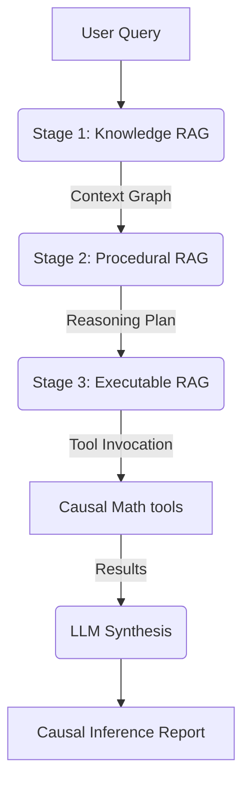

# Architecture Overview

The Causal Intelligence Module (CIM) utilizes a **Sequentially Tiered RAG (Retrieval-Augmented Generation)** architecture. Unlike standard RAG, which pulls context in one pass, CIM uses a "Snowball Pipeline" where each layer informs the next.

## The 3-Tier Pipeline

### 1. The Knowledge Layer (`knowledge_rag/`)
*   **Purpose:** Definition of Structural Framework.
*   **Components:** `cognitive_priors.csv`, `domain_graphs.csv`.
*   **Function:** This layer identifies the "First Principles" of the query. It retrieves pre-validated **Directed Acyclic Graphs (DAGs)** for the relevant domain. 
*   **Output:** A grounded "Context Graph" that defines which variables are relevant and how they are hypothesized to connect.

### 2. The Procedural Layer (`procedural_rag/`)
*   **Purpose:** Reasoning Discipline and Fallacy Detection.
*   **Components:** `causal_reasoning_procedures.csv`, `anti_patterns.csv`, `discovery_procedures.csv`.
*   **Function:** The agent selects a "Reasoning Template" based on the query type (e.g., Intervention vs. Evaluation). Crucially, this layer activates **"Logic Gates"** via the Anti-Patterns dataset to proactively block common fallacies (e.g., Simpson's Paradox).
*   **Output:** A step-by-step reasoning plan that is explicitly "hard-linked" to mathematical tools.

### 3. The Executable Layer (`executable_rag/`)
*   **Purpose:** Deterministic Validation.
*   **Components:** `ability_injectors.csv`, `causal_math_registry.csv`.
*   **Function:** This layer applies behavioral overrides (e.g., "Strict Causal Discipline"). It maps the plan's steps to deterministic Python functions (Cohen's d, Bayesian updates, etc.).
*   **Output:** Validated mathematical results that the LLM uses to synthesize the final conclusion.

## Data Flow Diagram (Logical)

## Namespace Philosophy

We separate these layers to ensure **Retrieval Integrity**. By isolating "How to calculate" (Executable) from "What is true" (Knowledge), we prevent the LLM from hallucinating math while still allowing it to be creative in its mechanistic brainstorming.
