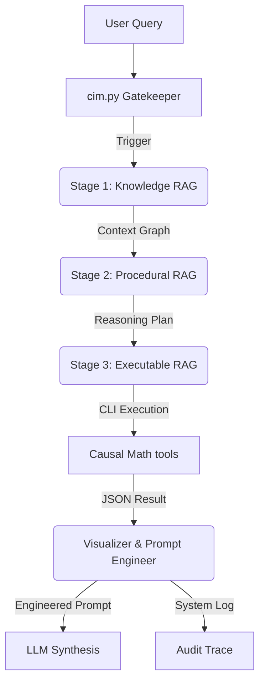

# Architecture Overview

The Causal Intelligence Module (CIM) utilizes a **Sequentially Tiered RAG (Retrieval-Augmented Generation)** architecture. Unlike standard RAG, which pulls context in one pass, CIM uses a "Snowball Pipeline" where each layer informs the next.

## The 3-Tier Pipeline

### 0. The Gatekeeper (`cim.py`)
*   **Purpose:** Threshold validation and On-Demand Activation.
*   **Function:** Determines if a query requires deep causal reasoning or can be bypassed for associative LLM responses.

### 1. The Knowledge Layer (`knowledge_rag/`)
*   **Purpose:** Definition of Structural Framework.
*   **Components:** `cognitive_priors_v2.csv`, `domain_graphs.csv`.
*   **Specialized Builders:**
    *   **Light**: Rapid, linear context.
    *   **Heavy**: Deep validation + fallacy mitigation logic-gates.
    *   **Strategic**: Converts graphs into Influence Diagrams (Decision/Utility nodes).
    *   **Temporal**: Focuses on time-lags and historical precedence.
    *   **Simulation**: Parallel "Counterfactual World" branching.
*   **Output:** A grounded "Context Graph" exported as JSON.

### 2. The Procedural Layer (`procedural_rag/`)
*   **Purpose:** Reasoning Discipline and Fallacy Detection.
*   **Components:** `causal_reasoning_procedures_v2.csv`, `anti_patterns.csv`, `discovery_procedures.csv`.
*   **Function:** The agent selects a "Reasoning Template" based on the query type (e.g., Intervention vs. Evaluation). Crucially, this layer activates **"Logic Gates"** via the Anti-Patterns dataset to proactively block common fallacies (e.g., Simpson's Paradox).
*   **Output:** A step-by-step reasoning plan that is explicitly "hard-linked" to mathematical tools.

### 3. The Executable Layer (`executable_rag/`)
*   **Purpose:** Deterministic Validation.
*   **Components:** `ability_injectors_v2.csv`, `causal_math_registry.csv`.
*   **Function:** This layer applies behavioral overrides (e.g., "Strict Causal Discipline"). It maps the plan's steps to deterministic Python functions (CLI-accessible tools).
*   **Output:** Validated mathematical results (JSON) and copy-pasteable terminal commands.

### 4. Perception & Synthesis (The "Output" Layer)
*   **Mermaid Visualization**: Translates JSON graphs into interactive Mermaid.js diagrams.
*   **Causal Prompt Engineer**: Converts raw graph logic into strict LLM system directives.
*   **Audit Logger**: Saves a full JSON trace of every execution to `logs/causal_traces/`.

## Data Flow Diagram (Logical)

## Namespace Philosophy

We separate these layers to ensure **Retrieval Integrity**. By isolating "How to calculate" (Executable) from "What is true" (Knowledge), we prevent the LLM from hallucinating math while still allowing it to be creative in its mechanistic brainstorming.
